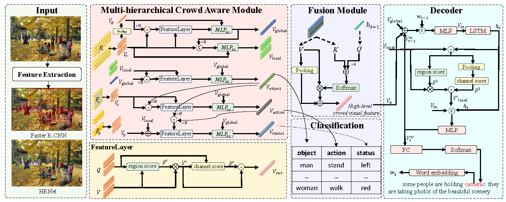

# What Happens in Crowd Scenes: A New Dataset about Crowd Scenes for Image Captioning
<div align="center">
  
</div>

## Introduction  
This is the code for Crowd Scenes Captioning task based on [xmodaler](https://github.com/YehLi/xmodaler).

The original paper can be found [here](https://ieeexplore.ieee.org/abstract/document/9834140).

## Installation
See [installation instructions](https://xmodaler.readthedocs.io/en/latest/tutorials/installation.html).

## Requiremenets
* Linux or macOS with Python >= 3.6
* PyTorch and torchvision that matches the PyTorch installation. Install them together at pytorch.org to make sure of this
* fvcore
* pytorch_transformers
* jsonlines
* pycocotools 

## Getting Started 
See [Getting Started with X-modaler](https://xmodaler.readthedocs.io/en/latest/tutorials/getting_started.html)

## CrowdCaption Preparation
1 Introducion: [Official introduction](https://ivipclab.github.io/publication_crowdcaption/multicaption/).

2 Feature: You can download our feature (npy file) [here](https://pan.baidu.com/s/1-PaGY5FQxZZKE9S5fecERw?pwd=6826), 
including faster-rcnn, swin-transformer, hrnet. Please put it into
```
 ./open_source_dataset/crowdscenes_caption/features
```

3 Annotation: You can download [here](https://pan.baidu.com/s/1eraODLJ-uqu2_osJX_7ipQ?pwd=6826). Please put it into
```
./open_source_dataset/crowdscenes_caption
```

4 Evaluation: You can download [here](https://pan.baidu.com/s/1QIgTKi8r18VqY9Z7i31ITQ?pwd=6826) or use official evaluation code.
 Please put it into
```
./cococaption
```

Acess code：6826
## Training & Evaluation  

Assume that you are under the root directory of this project, and you have activated 
your virtual environment if needed, and with crowdcaption dataset in 
'open_source_dataset/crowdscenes_caption'. Here, we use 8GPUs.

```
# for xe training
bash train.sh

# for reward training
bash train_rl.sh

# for test
bash test.sh
```

Training and inference for other datasets in different config files are similar to the above description.

## Performance and Trained Models
The performance and trained models will be released soon, please wait...

## Acknowledgement
Thanks Xmodaler team for the wonderful open source project!

## Citition
If you find the mmdetection-ref toolbox useful in your research, please consider citing:  
```
@article{wang2022happens,
  title={What Happens in Crowd Scenes: A New Dataset about Crowd Scenes for Image Captioning},
  author={Wang, Lanxiao and Li, Hongliang and Hu, Wenzhe and Zhang, Xiaoliang and Qiu, Heqian and Meng, Fanma and Wu, Qingbo},
  journal={IEEE Transactions on Multimedia},
  year={2022},
  publisher={IEEE}
}
```
